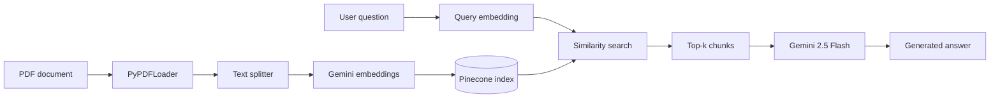

# RAG Project

A Retrieval-Augmented Generation (RAG) pipeline that ingests a PDF document, embeds it with Google Gemini, stores vectors in Pinecone, and answers questions using retrieved context and Gemini generation.

Built as a Jupyter notebook workflow for experimenting with document Q&A over custom PDFs (including Hebrew text).

## How it works



1. **Load** — Read pages from a PDF with LangChain's `PyPDFLoader`.
2. **Chunk** — Split text into overlapping segments (`chunk_size=500`, `overlap=50`).
3. **Embed** — Generate vectors with `models/gemini-embedding-2` (3072 dimensions).
4. **Store** — Upsert vectors and metadata into a Pinecone serverless index.
5. **Retrieve** — Embed the user query and fetch the top matching chunks.
6. **Generate** — Pass retrieved context to `models/gemini-2.5-flash` to produce an answer grounded in the document.

## Tech stack

| Component | Technology |
|-----------|------------|
| Document loading | LangChain + PyPDF |
| Embeddings | Google Gemini (`gemini-embedding-2`) |
| Vector store | Pinecone (serverless) |
| Generation | Google Gemini (`gemini-2.5-flash`) |
| Environment | Python 3.13, Jupyter |

## Prerequisites

- Python 3.10+
- API keys for:
  - [Google AI Studio](https://aistudio.google.com/) (Gemini)
  - [Pinecone](https://www.pinecone.io/)
- A PDF file to index (default: `data.pdf` in the project root)

## Setup

### 1. Clone and enter the project

```bash
cd "RAG project"
```

### 2. Create a virtual environment

```bash
python -m venv .venv

# Windows
.venv\Scripts\activate

# macOS / Linux
source .venv/bin/activate
```

### 3. Install dependencies

```bash
pip install python-dotenv certifi pinecone langchain langchain-community langchain-text-splitters langchain-google-genai google-genai pypdf jupyter
```

### 4. Configure environment variables

Create a `.env` file in the project root:

```env
GEMINI_API_KEY=your_gemini_api_key
PINECONE_API_KEY=your_pinecone_api_key
PINECONE_INDEX_NAME=rag-llm-index
PINECONE_CLOUD=aws
PINECONE_REGION=us-east-1
PDF_PATH=data.pdf
```

| Variable | Required | Description |
|----------|----------|-------------|
| `GEMINI_API_KEY` | Yes | Google Gemini API key |
| `PINECONE_API_KEY` | Yes | Pinecone API key |
| `PINECONE_INDEX_NAME` | No | Pinecone index name (default: `rag-llm-index`) |
| `PINECONE_CLOUD` | No | Pinecone cloud provider (default: `aws`) |
| `PINECONE_REGION` | No | Pinecone region (default: `us-east-1`) |
| `PDF_PATH` | No | Path to the source PDF (default: `data.pdf`) |

> **Note:** `.env` is gitignored. Never commit API keys.

### 5. Add your PDF

Place your document at the path set in `PDF_PATH` (e.g. `data.pdf`). PDF files are also gitignored by default.

## Usage

Open and run the notebook top to bottom:

```bash
jupyter notebook rag_pipeline.ipynb
```

### Pipeline cells (in order)

| Step | What it does |
|------|----------------|
| Imports & SSL setup | Load libraries and configure certificates |
| Environment | Load `.env` and validate keys / PDF path |
| Load PDF | Read all pages from the document |
| Chunk text | Split into searchable segments |
| Pinecone index | Create index if missing (3072-dim, dotproduct metric) |
| Embed & upsert | Embed each chunk and upload to Pinecone in batches |
| `retrieve()` | Search Pinecone and print top matches (retrieval only) |
| `generate_answer()` | Retrieve context + generate an answer with Gemini |

### Example: retrieval only

```python
retrieve("What is the inclusion-exclusion principle?")
```

### Example: full RAG answer

```python
generate_answer("How is Pascal's triangle related to the binomial theorem?")
```

## Project structure

```
RAG project/
├── rag_pipeline.ipynb   # Main RAG workflow
├── .env                 # Local secrets (not committed)
├── .gitignore
└── README.md
```

## Configuration notes

- **Embedding model:** `models/gemini-embedding-2` produces **3072-dimensional** vectors. The Pinecone index must be created with `dimension=3072`. If you reuse an older index with a different dimension (e.g. 1536), upserts will fail with a dimension mismatch error — delete the old index or use a new index name.
- **Rate limiting:** The notebook sleeps between embedding calls (`0.7s`) to reduce API throttling on large documents.
- **Batch uploads:** Vectors are upserted to Pinecone in batches of 50.

## Troubleshooting

| Issue | Fix |
|-------|-----|
| `Missing GEMINI_API_KEY` / `Missing PINECONE_API_KEY` | Add keys to `.env` |
| `PDF file not found` | Check `PDF_PATH` points to an existing file |
| `Vector dimension 3072 does not match the dimension of the index` | Delete the Pinecone index and re-run index creation, or change `PINECONE_INDEX_NAME` |
| SSL / certificate errors on Windows | The notebook includes a certifi SSL workaround cell — run it before API calls |

## License

Add your license here if applicable.
